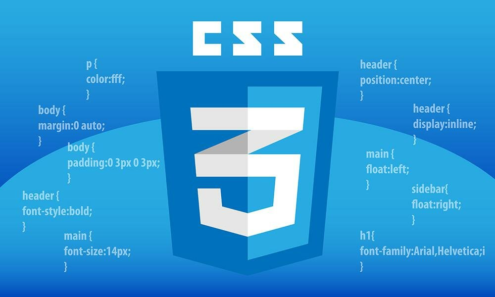
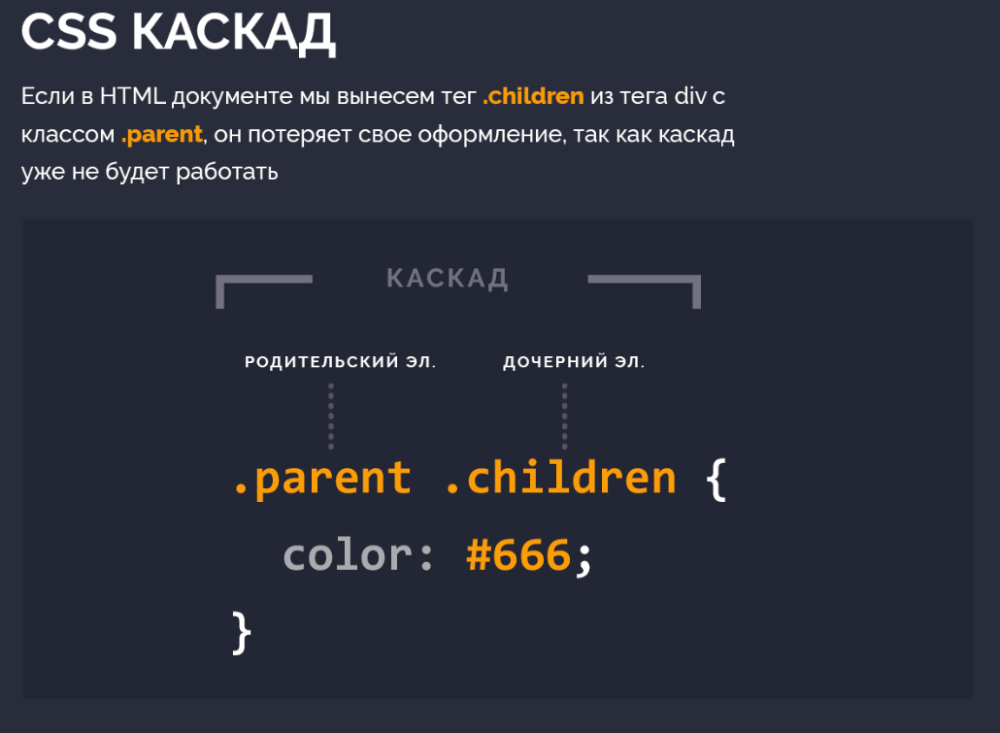
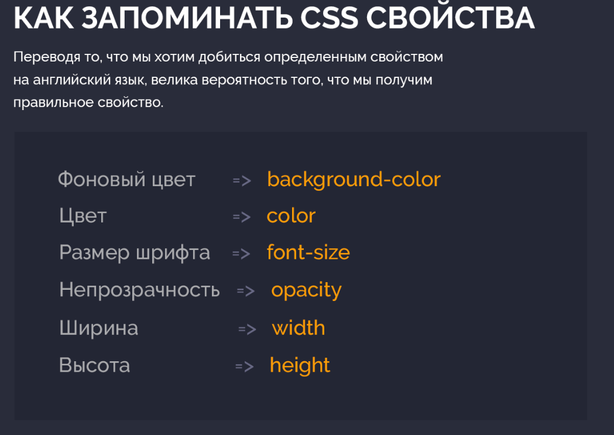
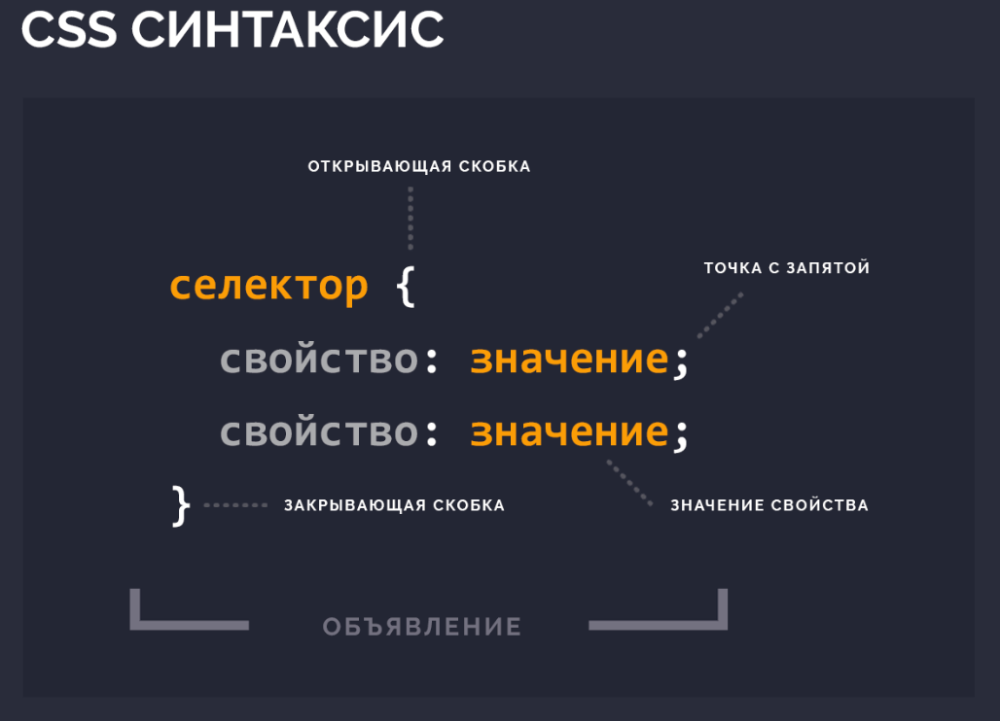
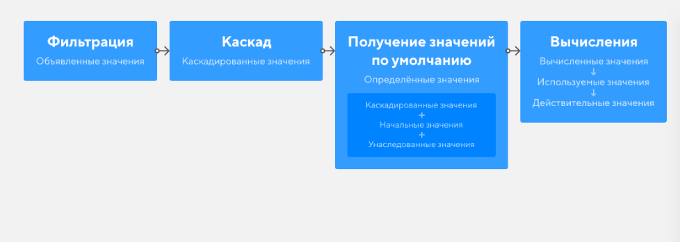

# CSS - это

<b>CSS означает Cascading Style Sheets (Каскадная Таблица Стилей)</b>
CSS описывает как HTML элементы должны отображаться на экране, бумаге или других носителях
CSS экономит много работы. Он может управлять макетом нескольких веб страниц одновременно
Внешние таблицы стилей хранятся в CSS файлах

CSS используется для определения стилей для ваших веб страниц, включая дизайн, макет и вариации отображения для различных устройств и размеров экрана.

## Каскадность

<a href="https://htmlacademy.ru/blog/html/cascade-works" target="_blank">Статья про каскадность</a>
