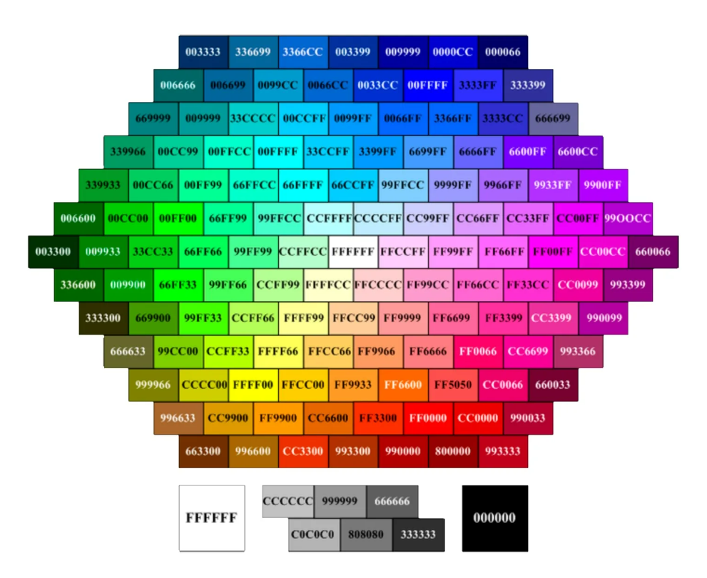

# Цветы и градиенты

В вебе используют целых 3 уникальные цветовые системы, а также 
есть возможность создавать сложные градиенты.

Генератор градиентов - https://cssgradient.io/
https://css-tricks.com/css3-gradients/
https://csscolor.ru/