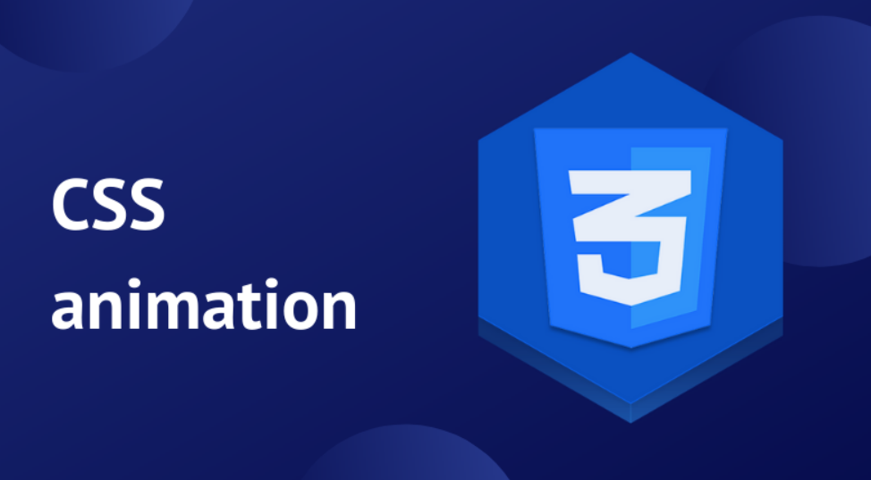

# Переходы и анимация

Плавное и регулируемое изменение состояний страницы очень важно для 
улучшения пользовательского опыта.

<a href="https://animista.net/" target="_blank">Много примеров - текст, background и т.д.</a>  
<a href="https://codepen.io/nazarelen/pen/EaNbLX" target="_blank">Пример 2D transform</a>  

## CSS Transitions

<a href="http://css3.bradshawenterprises.com/transitions/" target="_blank">Примеры</a>
