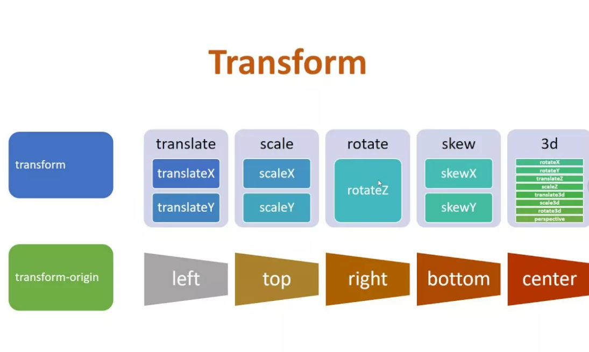

# Трансформации


С CSS3 появились новые способы позиционирования и изменения элементов. 
Теперь можно пересмотреть общие методы компоновки с альтернативными способами изменения 
размера, положения и изменения элементов. Все эти новые методы стали возможными благодаря 
transformсвойству.

Свойство transformпоставляется в двух разных настройках, двумерной и трехмерной. 
Каждый из них имеет свои индивидуальные свойства и значения.

```css
div {
  -webkit-transform: scale(1.5);
     -moz-transform: scale(1.5);
       -o-transform: scale(1.5);
          transform: scale(1.5);
}
```
<br/>
<br/>

<a href="https://learn.shayhowe.com/advanced-html-css/css-transforms/" target="_blank">Информация о 2D-3D Transform</a>

<a href="https://codepen.io/nazarelen/pen/EaNbLX" target="_blank">Пример - 1</a>
<a href="https://codepen.io/nazarelen/pen/aNQNva" target="_blank">Пример - 2</a>
<a href="https://codepen.io/nazarelen/pen/BKGZPP" target="_blank">Пример - 2</a>
