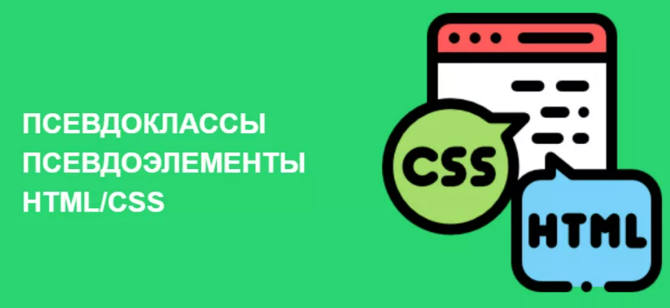
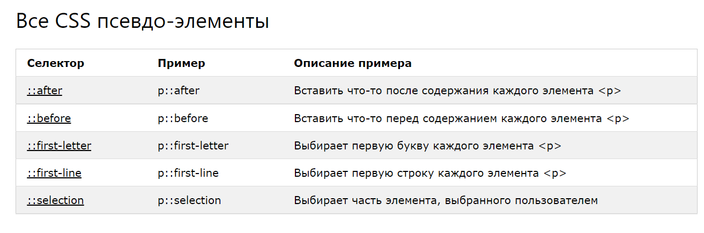

# Псевдоэлементы и псевдоклассы


Что такое псевдо-элементы?
Псевдо-элемент используется для оформления указанной части элемента.

Например, он может быть использовано для:

Стиля первой буквы или линии элемента
Вставки содержимого до или после элемента

```html
селектор::псевдо-элемент {
   свойство:значение;
}
```

Псевдо-элемент - ::first-line
Псевдо-элемент ::first-line используется, чтобы добавить специальный стиль к первой строке текста.

Следующий пример форматирует первую строку текста во всех элементах p:

```html
p::first-line {
   color: #ff0000;
   font-variant: small-caps;
}
```

Пример - https://www.schoolsw3.com/css/trycss_firstline.php


Псевдо-элемент - ::before
Псевдо-элемент ::before может использоваться, чтобы вставить содержимое до содержимого элемента.

Следующий пример вставляет изображение, перед содержания каждого элемента h1:

```css
h1::before {
   content: url(smiley.gif);
}
```

Пример - https://www.schoolsw3.com/css/trycss_before.php

Псевдо-элемент - ::after
Псевдо-элемент ::after может использоваться, чтобы вставить содержимое после содержимого элемента.

Следующий пример вставляет изображение после содержания каждого элемента h1:

```css
h1::after {
   content: url(smiley.gif);
}
```

Пример  https://www.schoolsw3.com/css/trycss_after.php



## Псевдо-классы


Псевдо-класс используется для определения особого состояния элемента.

Например, он может быть использован для:

Стиля элемента при наведении курсора мыши
Стиля посещенных и непосещенных ссылок
Стиля элемента, для получения фокуса

```css
Селектор: псевдо-класс {
   Свойство: значение;
}
```

```css
/* непросмотренная ссылка */
a:link {
   color: #FF0000;
}

/* просмотренная ссылка */
a:visited {
   color: #00FF00;
}

/* наведение мыши на ссылку */
a:hover {
   color: #FF00FF;
}

/* активная ссылка */
a:active {
   color: #0000FF;
}
```

Пример - https://www.schoolsw3.com/css/trycss_link.php

Псевдо-классы и классы CSS

```css
a.highlight:hover {
   color: #ff0000;
}
```

https://www.schoolsw3.com/css/trycss_pseudo-class.php пример

Наведите на p - показываем блок

```css
p {
   display: none;
   background-color: yellow;
   padding: 20px;
}

div:hover p {
   display: block;
}
```

пример https://www.schoolsw3.com/css/trycss_pseudo-class_hover_tooltip.php