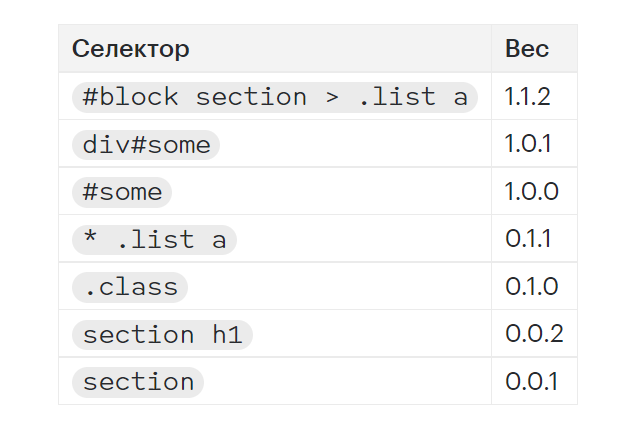

# Специфичность

<b>Специфичность</b> — это алгоритм, благодаря которому браузер определяет, 
какие именно стили из всего набора применить к элементу. В вычислениях участвуют CSS-селекторы. 
Если одному и тому же элементу подходит сразу несколько CSS-правил с разными селекторами, 
то браузер применяет те стили, вес селектора которых больше. Правило каскада «кто ниже, 
тот и выигрывает» при этом может нарушаться.

Давайте разберёмся, как браузер взвешивает селектор. 
Ниже перечислены типы селекторов по убыванию специфичности:

- Селекторы по идентификатору;
- Селекторы по классу, селекторы по атрибуту и селекторы с псевдоклассами;
- Селекторы по тегу, селекторы с псевдоэлементами.
- Комбинаторы +, >, ~, универсальный селектор * и псевдокласс :where() веса не имеют.
- Псевдоклассы :is(), :has() и :not() принимают вес наиболее специфичного селектора внутри скобок.

## Система расчёта Секция статьи "Система расчёта"
Существует удобный способ вычисления веса селектора в уме. Выше мы перечислили три группы сущностей, 
из которых может состоять селектор. Представим любой селектор в виде трёх нулей: 0.0.0.

Селекторы по идентификатору увеличивают первую цифру.
Селекторы по классу, по атрибуту или псевдокласс увеличивают вторую цифру.
Селектор по тегу или псевдоэлемент увеличивают третью цифру.
Один селектор равен единице.

Пока сложно понять. Давайте разберёмся на примерах.

Селектор <b>#some</b> состоит из одного идентификатора. Один селектор = 1. Увеличиваем первую цифру на 1. 
В итоге вес такого селектора равен 1.0.0.
.class состоит из одного класса. Увеличиваем вторую цифру на 1. Получаем вес селектора 0.1.0.
section состоит из одного тега. Увеличиваем последнюю цифру на 1. Вес селектора равен 0.0.1.
Дальше аналогично можем посчитать вес комбинированных селекторов.

<b>div#some</b> состоит из одного селектора по тегу и одного идентификатора. Селектор по 
тегу увеличивает последнюю цифру, селектор по идентификатору — первую. Вес селектора равен 1.0.1.

<b>section h1</b> состоит из двух селекторов по тегу. Увеличиваем последнюю цифру на два и получаем вес 0.0.2.

<b>#block section > .list a</b> состоит из идентификатора (первая цифра), двух тегов (последняя цифра) и 
класса (вторая цифра). Вес селектора равен 1.1.2.

<b>* .list a</b> состоит из одного класса и одного тега. Итоговый вес будет 0.1.1. Универсальный селектор ничего не весит

Для наглядности расположим селекторы по убыванию веса. Сверху самый тяжёлый.



## Атрибут style 

CSS-свойства, написанные в атрибуте style внутри HTML-разметки, перебивают свойства, 
написанные для этого элемента во внешних CSS-файлах или внутри тега style. Так что 
формально атрибут style самый специфичный, у него самый большой вес.

Иногда его добавляют в формулу в виде четвёртой цифры, стоящей перед всеми. Посмотрим на примере:

```html
<div class="element" id="this" style="color: purple; border: none">
  Some smart text
</div>
```

```css
div.element#this {
  color: green;
  border: 10px solid red;
}
```

У селектора в CSS будет специфичность 1.1.1, потому что там указан один идентификатор, 
один класс и один селектор тега. Но в итоге текст в блоке будет пурпурным, а рамки не 
будет совсем. Потому что у тега style вес равен 1.0.0.0


## !important 

Секция статьи "!important"
Ключевое слово !important нарушает все установленные спецификацией законы и 
насильно применяет свойство, после которого написано. Ему плевать на селектор CSS-правила, 
внутри которого это свойство написано. Будет так, и никак иначе.

Формально это ключевое слово не имеет отношения к концепции специфичности. 
Но из-за его варварских замашек нельзя не принимать его во внимание.

Тут к месту будет ещё раз напомнить, что ключевое слово !important всегда стоит использовать 
с осторожностью и не злоупотреблять им. В том числе из-за того, что оно нарушает естественную 
работу специфичности и каскада.