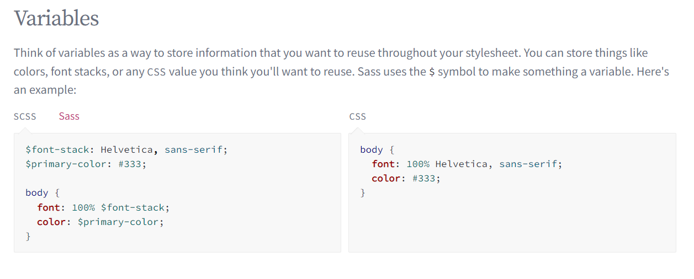
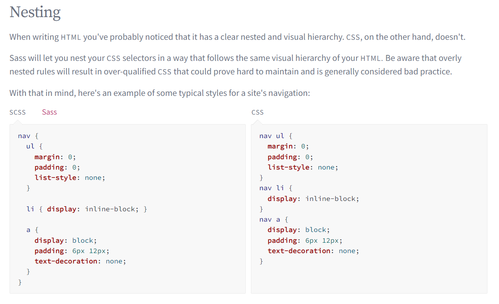
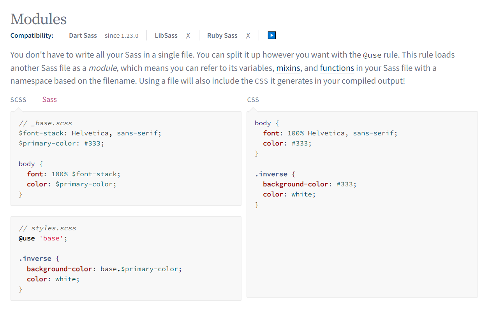
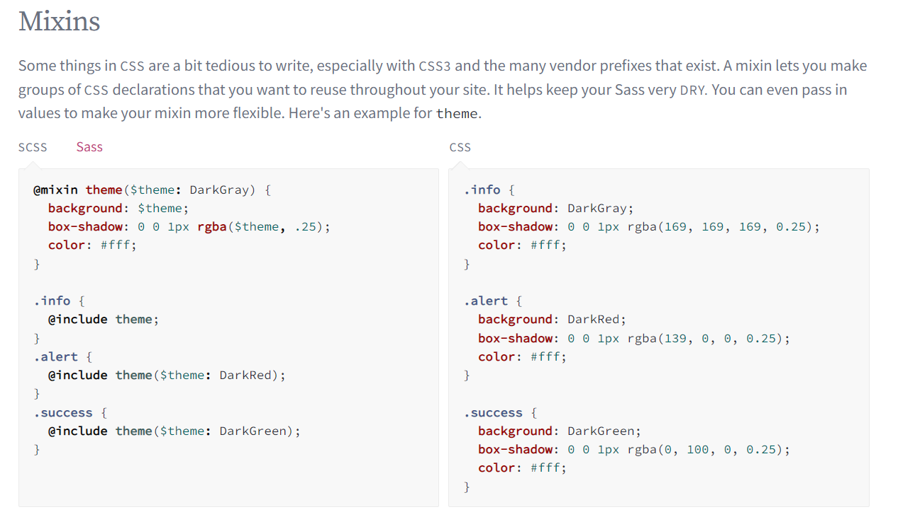
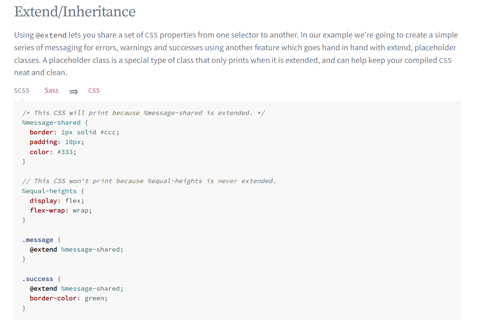
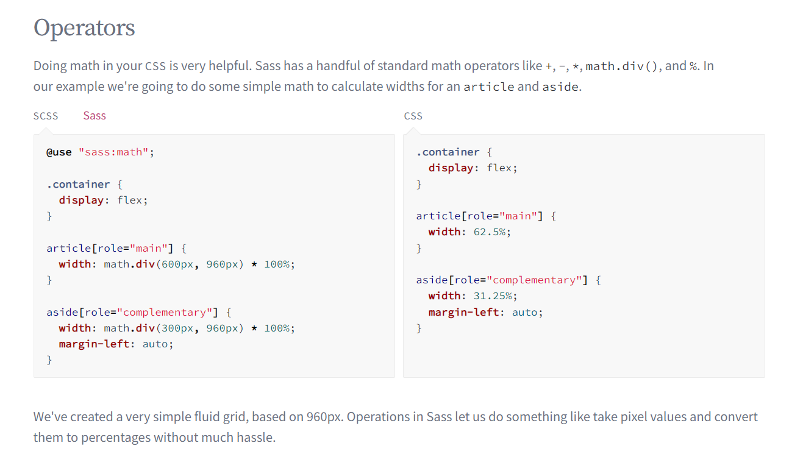

# Препроцессоры 

Использование препроцессоров облегчает и ускоряет CSS-разработку.

Виды:  
- SCSS
- SASS
- STYLES
- LESS

Доп:
- Автопрефиксы  пост-процессоры - статья - https://habr.com/ru/post/434098/ будет время то добавить

<a href="https://sass-lang.com/guide" target="_blank">Ссылка на документацию SCSS</a>  
<a href="https://thecode.media/speed-css/" target="_blank">Ссылка на Статья про препроцессоры</a>  

## Переменные

## Вложенные переменные

## Модули

## Mixins

## Расширения и наследования

## Операторы 

Выполнение математики в вашем CSS очень полезно. 
В Sass есть несколько стандартных математических операторов, таких как +, -, *, math.div() 
и %. В нашем примере мы собираемся выполнить простую математику, 
чтобы рассчитать ширину статьи и сбоку.

