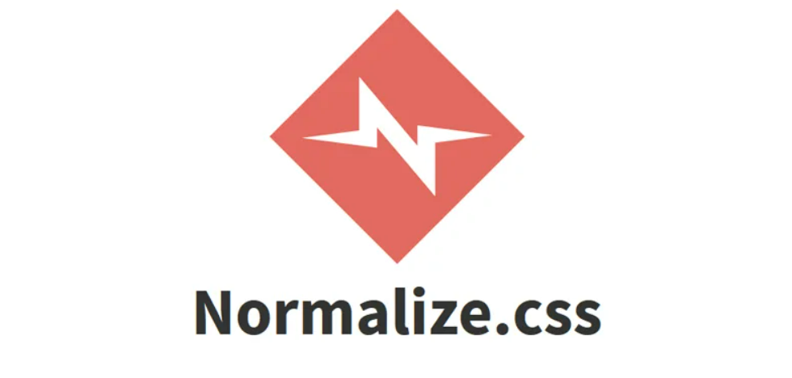

# Популярные практики

## Отловить ошибки
Некоторые правила stylelint направлены на выявление очевидных ошибок, обычно опечаток или недосмотров, сделанных, когда вы торопились, отвлекались или у вас были затуманенные глаза. Например, вы можете запретить пустые блоки, недопустимые шестнадцатеричные значения, повторяющиеся селекторы, неизвестные имена анимации и ошибочный синтаксис линейного градиента.

Другие правила делают все возможное, чтобы выявить более тонкие ошибки.

## Применять лучшие практики
Если вы используете систематическую методологию в своих таблицах стилей или у вас есть руководство по стилю для вашего кода, вы сможете решительно запретить определенные шаблоны. stylelint предоставляет средства для этого.

Прежде всего, вам нужно контролировать свои селекторы. Безжалостно. С помощью stylelint вы можете запретить селекторы, превышающие определенную специфичность, или ограничить глубину вложенности. Вы можете запретить категории селекторов (например, селекторы без идентификатора) и предоставить регулярные выражения, чтобы обеспечить соблюдение соглашений об именах для остальных.

Вы можете заблокировать использование !important хаков , или браузера, которые не применимы к поддерживаемым вами браузерам. Если вы используете Autoprefixer (что вам, вероятно, следует делать), вы можете запретить использование префиксов поставщиков в исходных таблицах стилей.

## Обеспечьте соблюдение соглашений о стиле кода
В stylelint есть множество правил, которые автоматически применяют соглашения о стиле кода, так что вам и вашим товарищам по команде это не нужно. Мы постарались сделать эти правила максимально всеобъемлющими и чрезвычайно гибкими .

Эти правила в основном касаются пробелов, но также нацелены на другие детали, такие как кавычки, регистр букв, начальные нули в дробных числах, использование ключевых слов вместо написания значений и т. д.

Мечта состоит в том, чтобы вы и ваши товарищи по команде могли один раз установить соглашение о форматировании (например, «Давайте всегда будем ставить один пробел после двоеточия в объявлении!»), кодифицировать его в конфигурации stylelint и больше никогда об этом не говорить. Оставьте правоприменение империи машин.

## Настроить и расширить все
Николас Закас, создатель ESLint (а также CSS Lint), писал , что ключом к успеху ESLint является его расширяемость. stylelint пытается последовать примеру ESLint и предоставить авторам CSS максимально расширяемый линтер.

Вы можете писать и публиковать свои собственные правила в виде плагинов. Уже есть куча доступных; и нам не терпится увидеть, что еще придумают люди.

Конфигурации расширяемы и, следовательно, доступны для совместного использования. Как и в случае с плагинами, мы узнали о ценности этой функции от ESLint. Посмотрите, что уже опубликовано , включая конфиги от WordPress и SUITCSS.

## Normalize.css

Normalize — это небольшой файл CSS, обеспечивающий лучшую согласованность стилей HTML-элементов в разных браузерах. Это современная, готовая к HTML5 альтернатива традиционному сбросу CSS.

В настоящее время Normalize.css в той или иной форме используется Twitter Bootstrap , HTML5 Boilerplate , GOV.UK , Rdio , CSS Tricks и многими другими фреймворками, наборами инструментов и сайтами.

Цели normalize.css заключаются в следующем:

- Сохраняйте полезные настройки браузера по умолчанию , а не удаляйте их.
- Нормализация стилей для широкого спектра элементов HTML.
- Исправьте ошибки и распространенные несоответствия браузера.
- Повысьте удобство использования с помощью незначительных улучшений.
- Объясните код, используя комментарии и подробную документацию.
- Он поддерживает широкий спектр браузеров (включая мобильные браузеры) и включает CSS, нормализующий элементы HTML5, типографику, списки, встроенное содержимое, формы и таблицы.

Несмотря на то, что проект основан на принципе нормализации, он использует прагматичные значения по умолчанию там, где они предпочтительнее.

Нормализация против сброса
Стоит подробнее разобраться, чем normalize.css отличается от традиционных сбросов CSS.

Normalize.css сохраняет полезные значения по умолчанию
Сбросы создают однородный визуальный стиль, сглаживая стили по умолчанию почти для всех элементов. Напротив, normalize.css сохраняет множество полезных стилей браузера по умолчанию. Это означает, что вам не нужно повторно объявлять стили для всех общих типографских элементов.

Альтернатива - CSS-RESET

<a href="https://htmlacademy.ru/blog/html/about-normalize-css" target="_blank">Статья про normalize</a>  
