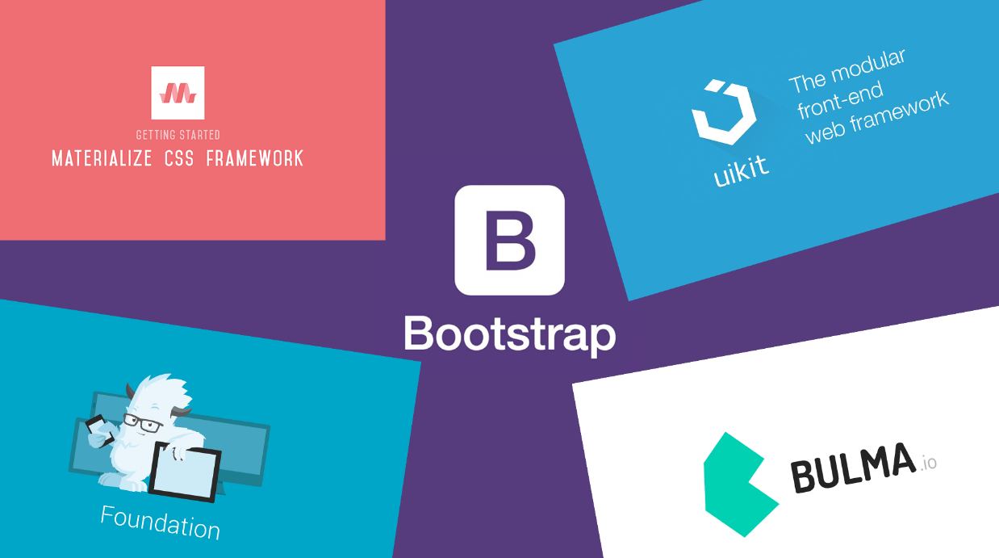

# Фреймворки CSS

Bootstrap, Material UI, Semantic UI и др

<a href="https://getbootstrap.com/" target="_blank">Bootstrap</a>  
<a href="https://semantic-ui.com/" target="_blank">Semantic-ui</a>  
<a href="https://materializecss.com/" target="_blank">Materialize.css</a>  
<a href="https://bulma.io/" target="_blank">Bulma</a>  
