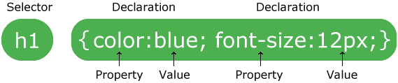

# Селекторы 

Набор правил CSS

Набор правил CSS состоит из селектора и блока объявлений:

Селектор указывает на HTML элемент, который вы хотите стилизовать.

Блок объявлений содержит одно или несколько объявлений, разделенных точкой с запятой.

Каждое объявление содержит имя свойства CSS и значение, разделенные двоеточием.

Несколько объявлений CSS разделяются точкой с запятой, а блоки объявлений окружаются фигурными скобками.

p {
color: red;
text-align: center;
}

p это селектор в CSS (он указывает на HTML элемент, который вы хотите стилизовать: 
).
color является свойством, а red является значение свойства
text-align является свойством, а center является значение свойства
