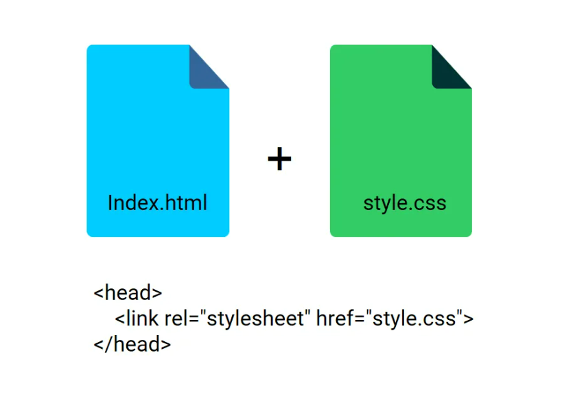
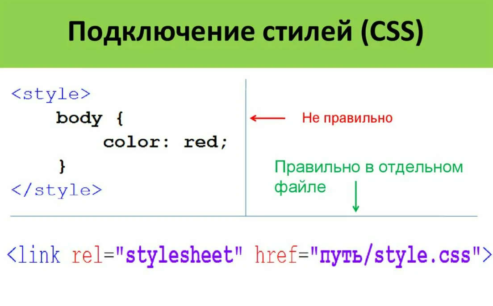
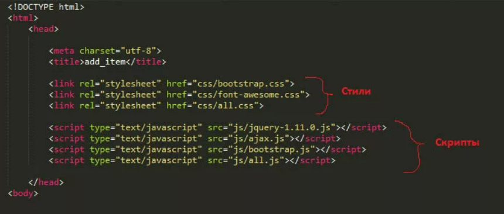

# Варианты подключения CSS


Существует три способа усновки каскадной таблицы стилей CSS: <br/>

- Внешний CSS <br/> + file + CDN
- Внутренний CSS <br/>
- Встроенный CSS <br/>

```html
CDN 

<link rel="stylesheet" href="https://maxcdn.bootstrapcdn.com/bootstrap/4.0.0/css/bootstrap.min.css" integrity="sha384-Gn5384xqQ1aoWXA+058RXPxPg6fy4IWvTNh0E263XmFcJlSAwiGgFAW/dAiS6JXm" crossorigin="anonymous">
<script src="https://maxcdn.bootstrapcdn.com/bootstrap/4.0.0/js/bootstrap.min.js" integrity="sha384-JZR6Spejh4U02d8jOt6vLEHfe/JQGiRRSQQxSfFWpi1MquVdAyjUar5+76PVCmYl" crossorigin="anonymous"></script>
```

## Подключение через тег style



## Встроенные - inline-style

```html
<!DOCTYPE html>
<html>
<body>

<h1 style="color:blue;text-align:center;">Это заголовок</h1>
<p style="color:red;">Это параграф.</p>

</body>
</html>
```

#### Пример -  JavaScripts + CSS



