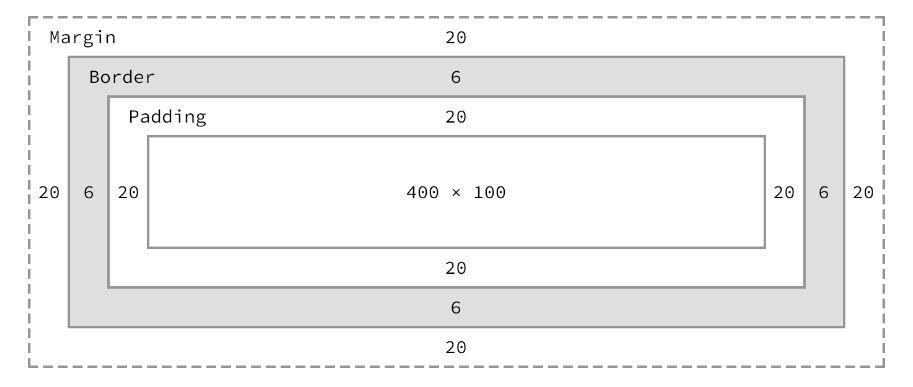
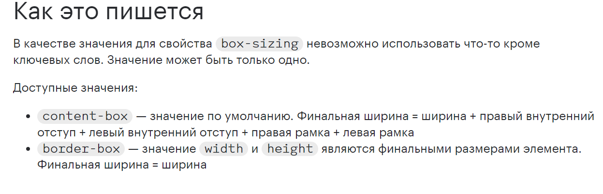

# Бокс-модель


```css
div {
  border: 6px solid #949599;
  height: 100px;
  margin: 20px;
  padding: 20px;
  width: 400px;
}
```




Блочная модель — одна из самых запутанных частей обучения написанию HTML и CSS. 
Это также одна из самых мощных частей HTML и CSS, и как только мы ее освоим, почти все 
остальное — например, позиционирование контента — будет даваться нам довольно легко.



<a href="https://learn.shayhowe.com/html-css/opening-the-box-model/" target="_blank">СТАТЬЯ - 1</a> <br/>
<a href="https://doka.guide/css/box-sizing/" target="_blank">СТАТЬЯ - 2</a> <br/>