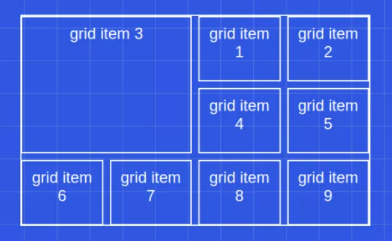

# Построение структуры
<a href="https://cssgridgarden.com/#ru" target="_blank">CSS Grid</a>  
<a href="https://webdesign.tutsplus.com/tutorials/a-comprehensive-guide-to-flexbox-alignment--cms-30183" target="_blank">Статья про flex</a>  

## Игры
<a href="https://flexboxfroggy.com/#ru" target="_blank">Flex-box</a>  
<a href="https://cssgridgarden.com/#ru" target="_blank">CSS Grid</a>  

## Шпаргалки
<a href="https://tpverstak.ru/flex-cheatsheet/" target="_blank">Шпаргалка Flex-box</a>  
<a href="https://tpverstak.ru/grid/" target="_blank">Шпаргалка CSS Grid</a>  
<a href="https://tpverstak.ru/adaptive-cheatsheet/" target="_blank">Шпаргалка адаптивности</a>  

## Flex-boxs

 <iframe src="https://codepen.io/tutsplus/embed/NzryJK?editors=1010" width="100%" height="500">
    Ваш браузер не поддерживает плавающие фреймы!
 </iframe>

 <iframe src="https://codepen.io/tutsplus/embed/YvWaXR?editors=1010" width="100%" height="500">
    Ваш браузер не поддерживает плавающие фреймы!
 </iframe>

 <iframe src="https://codepen.io/tutsplus/embed/KegZmZ?editors=1010" width="100%" height="500">
    Ваш браузер не поддерживает плавающие фреймы!
 </iframe>

 <iframe src="https://codepen.io/tutsplus/embed/NzrYRG?editors=1010" width="100%" height="500">
    Ваш браузер не поддерживает плавающие фреймы!
 </iframe>

 <iframe src="https://codepen.io/tutsplus/embed/KeMova?editors=1010" width="100%" height="500">
    Ваш браузер не поддерживает плавающие фреймы!
 </iframe>

 <iframe src="https://codepen.io/tutsplus/embed/eKdVKN?editors=1010" width="100%" height="500">
    Ваш браузер не поддерживает плавающие фреймы!
 </iframe>

 <iframe src="https://codepen.io/tutsplus/embed/PaGRBY?editors=1010" width="100%" height="500">
    Ваш браузер не поддерживает плавающие фреймы!
 </iframe>

 <iframe src="https://codepen.io/tutsplus/embed/PaGebz?editors=1010" width="100%" height="500">
    Ваш браузер не поддерживает плавающие фреймы!
 </iframe>

 <iframe src="https://codepen.io/tutsplus/embed/LrRmrY?editors=1010" width="100%" height="500">
    Ваш браузер не поддерживает плавающие фреймы!
 </iframe>

## Grid

 <iframe src="https://codepen.io/tutsplus/embed/ZoZoqY?editors=1010" width="100%" height="500">
    Ваш браузер не поддерживает плавающие фреймы!
 </iframe>

 <iframe src="https://codepen.io/tutsplus/embed/bMJKeX?editors=1010" width="100%" height="500">
    Ваш браузер не поддерживает плавающие фреймы!
 </iframe>

<a href="https://css-tricks.com/snippets/css/complete-guide-grid/" target="_blank">СТАТЬЯ - CSS Grid</a>  

## Позицианирование элементов 

<a href="https://www.freecodecamp.org/news/z-index-explained-how-to-stack-elements-using-css-7c5aa0f179b3" target="_blank">СТАТЬЯ - про позиционированние</a>  

 <iframe src="https://codepen.io/ivhed/embed/LmWMQb?editors=1010" width="100%" height="500">
    Ваш браузер не поддерживает плавающие фреймы!
 </iframe>

 <iframe src="https://codepen.io/tutsplus/embed/xjqmpV?editors=1010" width="100%" height="500">
    Ваш браузер не поддерживает плавающие фреймы!
 </iframe>

 <iframe src="https://codepen.io/tutsplus/embed/erGoJE?editors=1010" width="100%" height="500">
    Ваш браузер не поддерживает плавающие фреймы!
 </iframe>

 <iframe src="https://codepen.io/tutsplus/embed/YLZdjx?editors=1010" width="100%" height="500">
    Ваш браузер не поддерживает плавающие фреймы!
 </iframe>

 <iframe src="https://codepen.io/tutsplus/embed/QrdEBB?editors=1010" width="100%" height="500">
    Ваш браузер не поддерживает плавающие фреймы!
 </iframe>