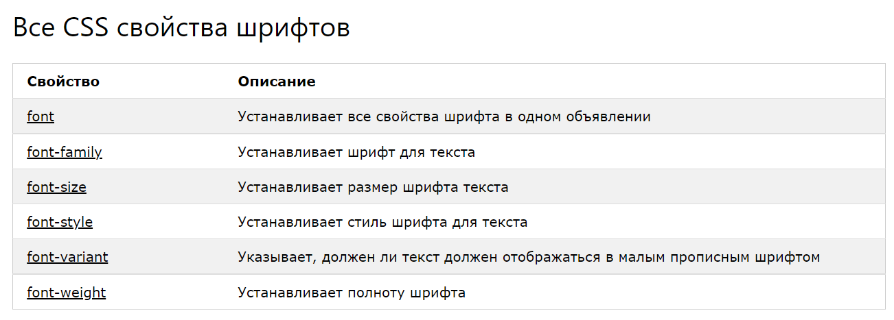

# Стилизация текста

<b>Цвет текста</b>
Свойство color используется для определения цвета текста. С помощью CSS, цвет указан чаще всего:

- Название цвета- "red"
- Значение HEX- "#ff0000"
- Значение RGB - "rgb(255,0,0)"


```css
body {
  color: blue;
}

h1 {
  color: green;
}
```

В этом примере мы определяем как свойство background-color, так и свойство color:

```css
body {
  background-color: lightgrey;
  color: blue;
}

h1 {
  background-color: black;
  color: white;
}

div {
  background-color: blue;
  color: white;
}
```

## Шрифты

CSS свойство font задает шрифту, утолшение, размер и стиль текста

#### Семейство шрифтов
Семейство шрифта текста определяется свойством font-family.

Свойство font-family следует установить несколько названий шрифтов в качестве 
"запасного варианта" для системы. Если браузер не поддерживает первый шрифт, он пробует следующий шрифт и так далее.

```html
<style>
    body {
        font-family: "Helvetica Neue", sans-serif;
    }

    h1 {
        font-family: "Vitesse", "Times New Roman";
    }
</style>

<h1>Sans-Serif Font</h1>
<p>Lorem ipsum dolor sit amet, consectetur adipisicingm ab cas, tempora eos.</p>
```

#### Стиль шрифта

Свойство font-style в основном используется для установки курсивного текста.

Свойство имеет три значения:

- normal - Текст отображается нормально
- italic - Текст отображается курсивом
- oblique - Текст отображается наклонным, он очень похож на курсив, но менее поддерживается браузерами

```css
p.normal {
font-style: normal;
}

p.italic {
font-style: italic;
}

p.oblique {
font-style: oblique;
}
```



