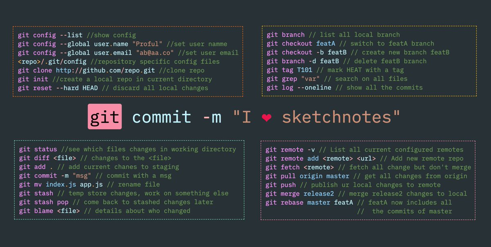
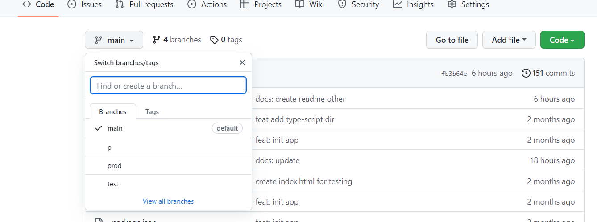

# Введение в Git

::: tip Определение
Git (произносится «гит») — распределённая система управления версиями. Проект был создан Линусом Торвальдсом для управления разработкой ядра Linux, первая версия выпущена 7 апреля 2005 года. На сегодняшний день его поддерживает Джунио Хамано.
:::

::: warning Интересное
Можно использовать не только для разработки, но и для различных задач не связанных с it.
:::

## Основные ссылки
<a href="https://git-scm.com/" target="_blank">Git off-site</a>  
<a href="https://github.com/cyberspacedk/Git-commands" target="_blank">Шпоргалка по Git</a>  
<a href="https://github.com/" target="_blank">GitHub</a>  

## Основные команды git

## GitHub Регистрация

## Создание нового репозитория (публично либо закрыто)

## Создан новый репозиторий

## Примеры веток в GitHub
