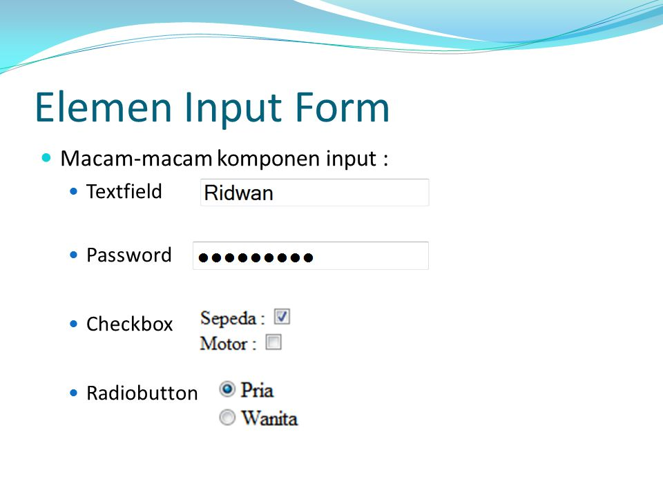

# Формы

::: tip Цель
Для сбора пользовательских данных используется HTML форма. 
Затем вводимые пользователем данные могут быть отправлены на сервер для обработки.
:::

```html
<!-- Тело формы обратной связи -->
<form>
    Поле ввода  <input type="text"  name="firstname" value="Введите имя">

    Радио-кнопки <input  type = "radio" name = "sex" value=  "male" checked>
                 <input type = "radio" name = "sex" value="female">

    Чекбоксы  <input type = "checkbox" name = "type1" value = "low">
              <input type = "checkbox" name = "type2" value = "2old">
    
              <button type = "submit">Кнопка отправки формы</button>
</form>
```



## Варианты типов у тега input

```html
<input type="button">
<input type="checkbox">
<input type="color">
<input type="date">
<input type="datetime-local">
<input type="email">
<input type="file">
<input type="hidden">
<input type="image">
<input type="month">
<input type="number">
<input type="password">
<input type="radio">
<input type="range">
<input type="reset">
<input type="search">
<input type="submit">
<input type="tel">
<input type="text">
<input type="time">
<input type="url">
<input type="week">
```

<a href="https://www.schoolsw3.com/html/html_form_input_types.php" target="_blank">Примеры на практику</a>

```html

<form>
  <label for="username">Имя пользователя:</label><br>
  <input type="text" id="username" name="username"><br>
  <label for="pwd">Пароль:</label><br>
  <input type="password" id="pwd" name="pwd">
</form>

<form action="/action_page.php">
    <label for="fname">Имя:</label><br>
    <input type="text" id="fname" name="fname" value="Андрей"><br>
    <label for="lname">Фамилия:</label><br>
    <input type="text" id="lname" name="lname" value="Щипунов"><br><br>
    <input type="submit" value="Отправить">
    <input type="reset">
</form>
```