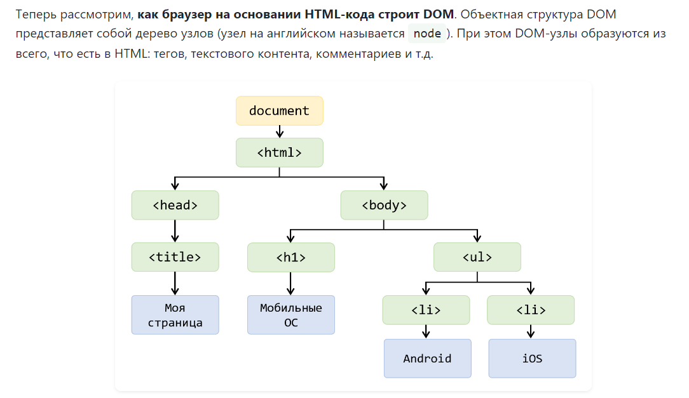
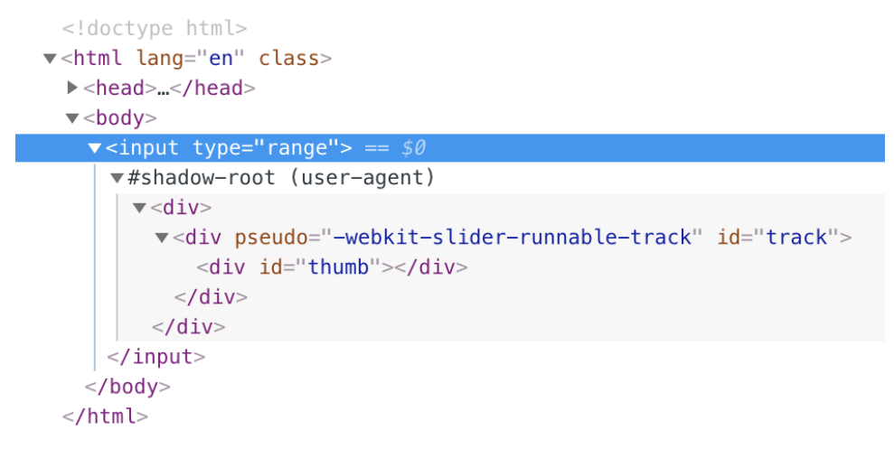

# DOM и Shadow DOM

## DOM
::: tip Определение
DOM – это объектное представление исходного HTML-кода документа.
Процесс формирования DOM происходит так: браузер получает HTML-код, парсит его и строит DOM.
:::

Итак, DOM – это объектная модель документа, которую 
браузер создаёт в памяти компьютера на основании HTML-кода.


Например, с помощью JavaScript мы можем:

- добавлять, изменять и удалять любые HTML-элементы на странице, в том числе их атрибуты и стили;
- получать доступ к данным формы и управлять ими;
- реагировать на все существующие HTML-события на странице и создавать новые;
- рисовать графику на HTML-элементе canvas и многое другое.



## Shadow DOM

Вы можете думать о теневом DOM как о «DOM внутри DOM». Это собственное 
изолированное дерево DOM со своими элементами и стилями, полностью изолированное 
от исходного DOM.

Хотя только недавно его стали использовать программисты, теневой DOM 
годами использовался пользовательскими агентами для создания и оформления 
сложных компонентов, таких как элементы формы. Для примера возьмем элемент 
ввода диапазона. Чтобы создать его на странице, 
все, что нам нужно сделать, это добавить следующий элемент:



Обратите внимание, что мы не просто использовали элемент "a"  в качестве теневого хоста, поскольку некоторые элементы, 
в первую очередь интерактивные элементы, не могут быть теневыми хостами.

Чтобы прикрепить теневой DOM к нашему хосту, мы используем метод  attachShadow().

```javascript
const shadowEl = document.querySelector(".shadow-host");
const shadow = shadowEl.attachShadow({mode: 'open'});
```

## DOM против shadow DOM
В некотором смысле, теневой DOM является «облегченной» версией DOM. Как и DOM, 
он является представлением элементов HTML, которое используется для определения того, 
что следует отображать на странице, и позволяет изменять элементы. Но в отличие от DOM, 
теневой DOM не использует глобальные стили документа. Теневой DOM, как следует из названия, 
всегда присоединен к элементу в обычном DOM. Без базовых элементов DOM, теневой DOM не существует.