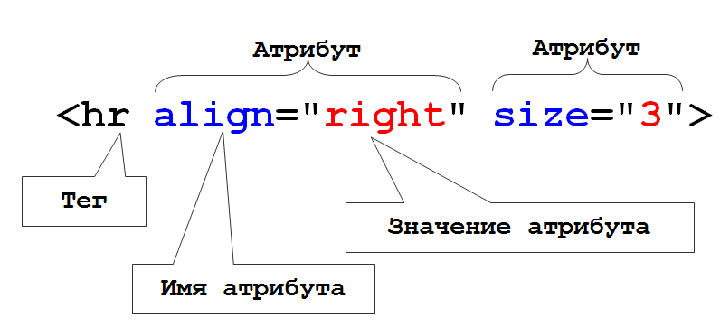
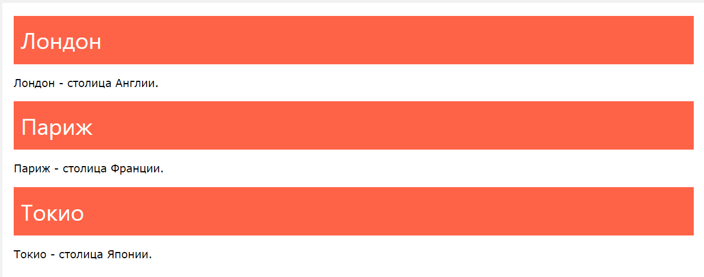

# Атрибуты и классы

## Атрибуты
::: tip Определение
Все HTML элементы могут иметь атрибуты
Атрибуты предоставляют дополнительную информацию об элементах
Атрибуты всегда задаются в начальном теге
Атрибуты обычно входят в пары имя/значение, такие как: name="value"
:::



## Data-* 

К счастью, в HTML5 была введена возможность использовать пользовательские атрибуты. 
Вы можете использовать любое имя в нижнем регистре с префиксом data-, например:
```html
<div id="msglist" data-user="bob" data-list-size="5" data-maxage="180"></div>
```

Пользовательские data-атрибуты:

это строки - в них вы можете хранить любую информацию, которая может быть представлена 
или закодирована в виде строки, например JSON. Приведение типов должно осуществляться с 
помощью JavaScript
должны использоваться в тех случаях, когда нет подходящих элементов HTML5 или атрибутов
относятся только к странице. В отличие от микроформатов они должны игнорироваться 
внешними системами, типа поисковых систем и поисковых роботов

Пример №1 обработки на JavaScript: getAttribute и setAttribute
Все браузеры позволяют вам получить и изменить data-атрибуты с использованием методов 
getAttribute и setAttribute:

```javascript
var msglist = document.getElementById("msglist");
var show = msglist.getAttribute("data-list-size");
msglist.setAttribute("data-list-size", +show+3);
```
Это работает, но должно использоваться только для поддержания совместимости со старыми браузерами.

## Устаревшие атрибуты


## Классы

::: tip Определение
Универсальный атрибут тега, с помощью которого можно задать имя 
любому элементу на странице. Имя элемента в дальнейшем используется в качестве 
селектора в CSS и позволяет управлять стилями элемента. К тому же по имени класса 
удобно искать и манипулировать элементами на странице при помощи JavaScript.
:::


```html
<style>
.city {
  background-color: tomato;
  color: white;
  padding: 10px;
}
</style>

<h2 class="city">Лондон</h2>
<p>Лондон - столица Англии.</p>

<h2 class="city">Париж</h2>
<p>Париж - столица Франции.</p>

<h2 class="city">Токио</h2>
<p>Токио - столица Японии.</p>
```


<a href="https://doka.guide/html/class/" target="_blank">Статья о классах</a>