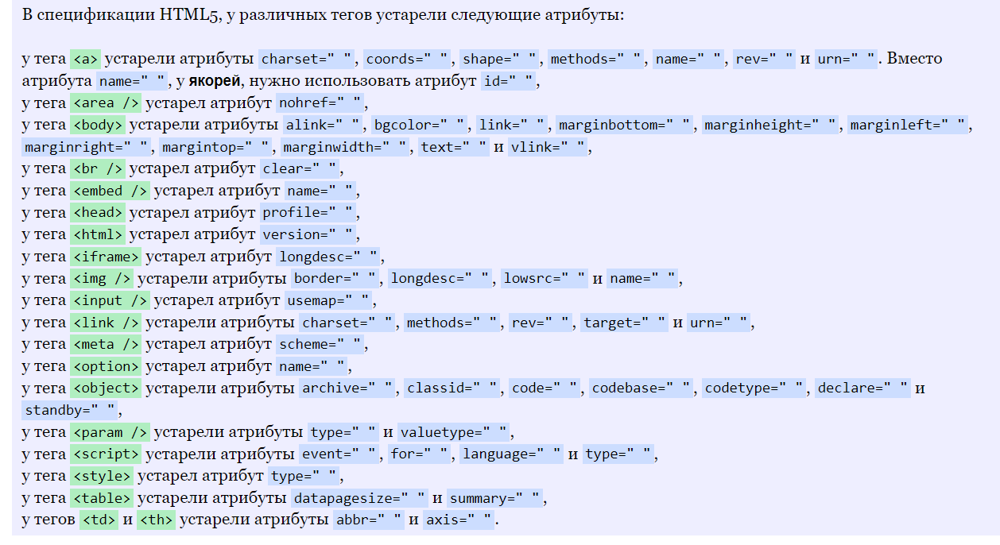

# Атрибуты и классы

https://basicweb.ru/html/atributy.php

http://htmlbook.ru/blog/atribut-data
 свой атрибуты

Атрибуты HTML
Все HTML элементы могут иметь атрибуты
Атрибуты предоставляют дополнительную информацию об элементах
Атрибуты всегда задаются в начальном теге
Атрибуты обычно входят в пары имя/значение, такие как: name="value"

## Классы

https://doka.guide/html/class/

https://www.schoolsw3.com/html/html_classes.php