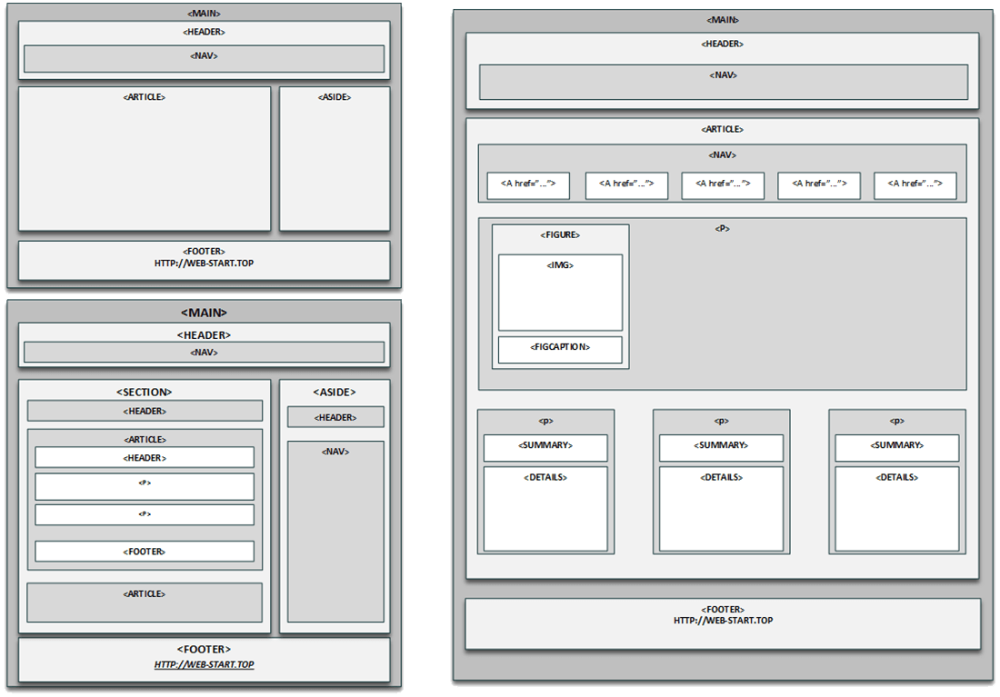
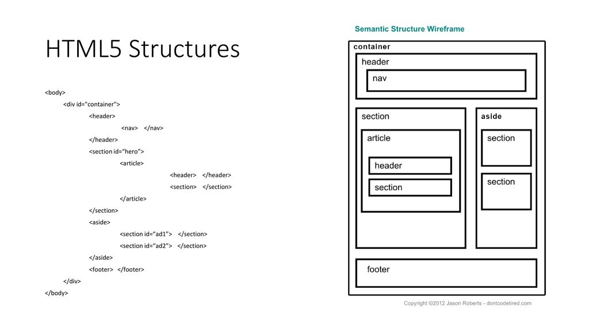

# Структура HTML файла

АТРИБУТЫ - РАССКАЗАТЬ ПРО НИХ
http://html-5.ru/ustarevshie-atributy-html5.php

```html
<!DOCTYPE html>
<html>
	<head>
		<title>Название для документа (страницы)</title>
	</head>
	<body>
		<h2>Это заголовок</h2>
		<p>Это параграф (абзац).</p>
	</body>
</html>
```



