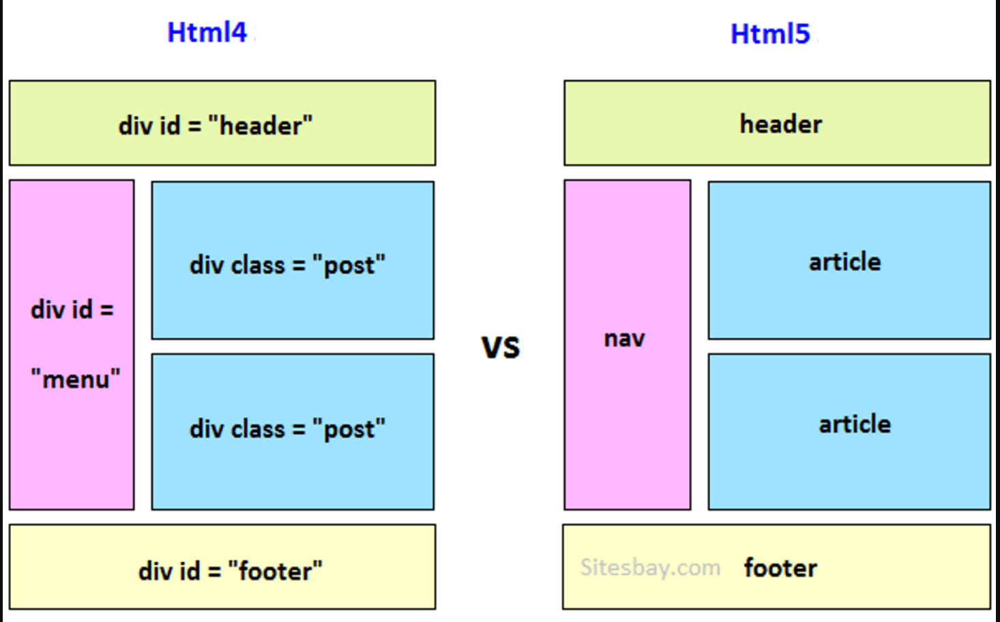

# HTML5 - Всего по чуть - чуть

### W3C

::: tip Определение
Консо́рциум Всеми́рной паути́ны (англ. World Wide Web Consortium, W3C) — организация, разрабатывающая
и внедряющая технологические стандарты для Всемирной паутины.
Основателем и главой Консорциума является сэр Тимоти Джон Бернерс-Ли,
автор множества разработок в области информационных технологий.
По состоянию на 29 мая 2019 года Консорциум насчитывает 444 члена.
:::

<a href="https://www.w3.org/" target="_blank">W3C</a> <br/>
<a href="https://w3c.org.ru/" target="_blank">W3C ru</a> <br/>
<a href="https://validator.w3.org/" target="_blank">W3C проверку на валидацию</a>


### I can use
<a href="https://caniuse.com/" target="_blank">I can use</a> <br/>


### Подключение стилей, скриптов, шрифтов, библиотек
```html
<!doctype html>
<html lang="ru">
<head>
    <meta charset="utf-8" />
    
    <title>Title</title>
    <meta name="viewport" content="width=device-width, initial-scale=1.0"> 
    <!--Строчка, которая делает магию-->
    
    <link rel="preconnect" href="https://fonts.googleapis.com">
    <link rel="preconnect" href="https://fonts.gstatic.com" crossorigin>
    
    <link href="https://fonts.googleapis.com/css2?family=Oswald:wght@400;500;700&display=swap" rel="stylesheet">
    <link rel="stylesheet" href="style.css" />
</head>
<body>

 ...    

<script src="main.js"></script>
</body>
</html>
```

### Cемантика правильные теги для слепых и для СЕО



#### Почему семантика важна? 
Чтобы сделать сайт доступным. Зрячие пользователи могут без проблем с 
первого взгляда понять, где какая часть страницы находится — где заголовок, 
списки или изображения. Для незрячих или частично незрячих всё сложнее. 
Основной инструмент для просмотра сайтов не браузер, который отрисовывает 
страницу, а скринридер, который читает текст со страницы вслух.

Этот инструмент «зачитывает» содержимое страницы, и семантическая 
структура помогает ему лучше определять, какой сейчас блок, а 
пользователю понимать, о чём идёт речь. Таким образом семантическая 
разметка помогает большему количеству пользователей взаимодействовать с 
вашим сайтом. Например, наличие заголовков помогает незрячим в навигации по 
странице. У скринридеров есть функция навигации по заголовкам, что ускоряет 
знакомство с информацией на сайте.

Чтобы сайт был выше в поисковиках. Компании, которые создают поисковики, 
не разглашают правила ранжирования, но известно, что наличие семантической 
разметки страниц помогает поисковым ботам лучше понимать, что находится на 
странице, и в зависимости от этого ранжировать сайты в поисковой выдаче.

### Bootstrap сетка

<a href="https://www.figma.com/file/4dViOL1grwQcE3sQEKBr5z/Bootstrap-4?node-id=0%3A1" target="_blank">Сетка</a> <br/>
ctr + shit + 4 - активирует сетку