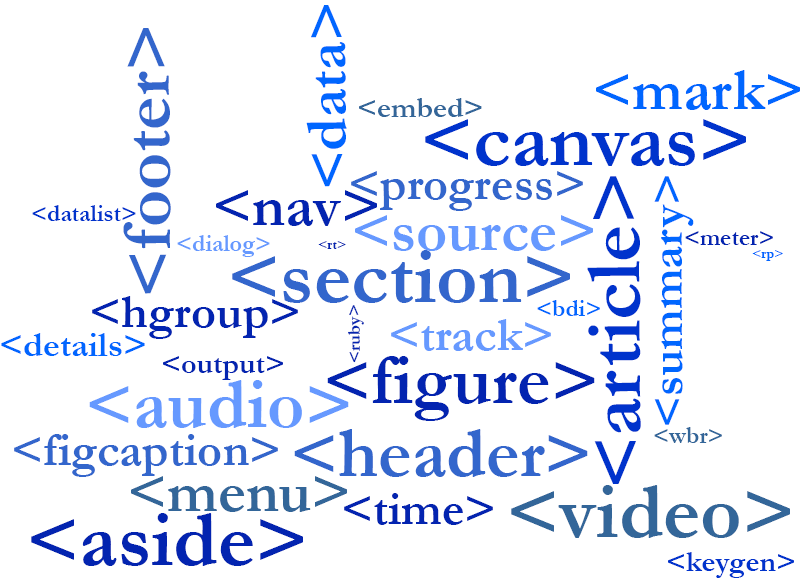
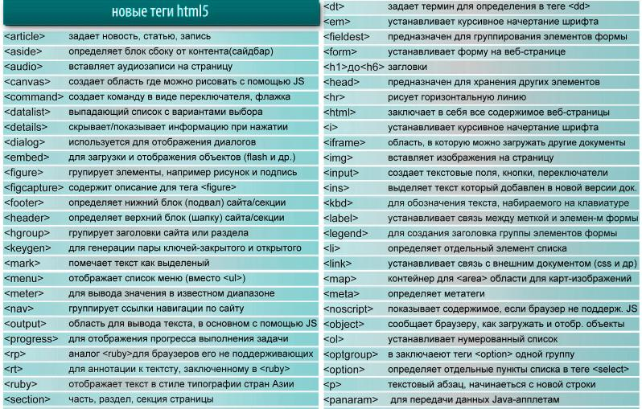

# HTML5 - новые теги



## Какие теги добавили в HTML5?
```html
В язык HTML5 добавили множество новых тегов:

— теги семантически описывающие структуру страницы,
— теги описывающие новые технологии,
— теги обогащающие язык HTML.

Семантическое описание структуры страницы в HTML5
Новые теги в HTML5 — это теги, семантически описывающие
структуру страницы, предназначены для того чтобы компьютерная
программа (например поисковый робот), смогла отличать 
основной контент, от остальных частей страницы: шапки, 
подвала, меню, сайдбара, повторяющихся (динамических) блоков 
и т.д. Также идёт семантическое разделение на уровне основного 
контента (текста старницы).


Семантика HTML5 на уровне структуры страницы
Рассмотрим список новых тегов HTML5, отвечающих за 
семантическое разделение структуры страницы:

<header> </header> — теги обрамляющие элементы дизайна верхней 
части сайта, так называемая "шапка страницы". Также теги header 
можно использовать как верхнюю часть тега section.

<nav> </nav> — теги обрамляющие основное меню на сайте.

<article> </article> — теги обрамляющие основной контент 
страницы: статью, запись в блоге, новость, первую запись 
форума и т.п.

<aside> </aside> — теги обрамляющие сайдбар. 
Сайдбар — это так называемая "боковая панель", которая обычно 
содержит блоки рубрик (категорий), облака тегов (меток), 
список последних записей и т.п. Тегами aside также можно обрамлять 
счетчики, виджеты (например комментарии от вконтакта), 
социальные кнопки.

<footer> </footer> — теги обрамляющие нижнюю часть сайта, так 
называемый "подвал страницы", который может содержать имя автора 
(компании), контакты (адреса, телефоны), правовую информацию (копирайты) 
и т.п. Также теги footer можно использовать как нижнюю часть тега section, 
т.е. сами теги footer будут находиться между тегами section

<section> </section> — теги обрамляющие повторяющиеся части страницы или 
основного контента, например если на странице находятся несколько глав 
рассказа, то каждую главу можно поместить между этими тегами. Или если 
вы нажмете на ссылку в сайдбаре (например по ссылке какой-нибудь рубрики), 
то появится страница на которой будут ссылки с описаниями, ведущие на статьи 
принадлежащие к данной рубрике, так вот ссылки с описаниями можно обрамлять 
тегами section, а также товары с описаниями в интернет магазине, комментарии 
к записям, комментарии к теме на форумах и т.д.

Естественно, всё это пока находится лишь на уровне рекомендаций, 
и вы можете вставлять данные теги куда угодно, используя их вместо 
тегов <div>, практическая же польза от них может появиться лишь 
тогда, когда поисковые системы (Яндекс, Гугл) начнут рекомендовать, 
где и когда использовать эти теги, для более высокого ранжирования сайтов.

    
Семантика HTML5 на уровне текста
Рассмотрим список новых тегов HTML5, отвечающих за семантическое 
разделение текста страницы:

<mark> </mark> — текст находящийся между этими тегами становится 
    "выделенным". Одно из предназначений тегов mark, обрамлять слова 
    в тексте, которые например совпадают со словом введённым 
    пользователем в поисковую строку.

<time> </time> — теги предназначены для создания дат и/или 
    времени в формате
    ISO вида: YYYY-MM-DDThh:mm:ss, такой формат понятен 
    компьютерным программам. Теги time могут обрамлять дату или 
    текст, если тег обрамляет текст, то в него добавляют атрибут 
    datetime, значением которого выступает дата и/или время в 
    формате ISO.

<details> </details> — теги предназначены для хранения информации, 
    которая либо скрыта, либо отображена (работает наподобие спойлера).

<summary> </summary> — теги обрамляют заголовок, если по нему щелкнуть 
    то появится текст (можно использовать в качестве спойлера), 
    находятся между тегами details.

    
Дополнительные теги языка HTML5
Список новых тегов HTML5, обогощающих язык:

<meter> </meter> — теги предназначены для вывода статического 
    индикатора шкалы, при котором результат измерения не меняется. 
    Для работы нужно минимальное и максимальное значения.

<progress> </progress> — теги предназначены для вывода динамического 
    индикатора шкалы (например шкалы загрузки файла), при котором 
    результат измерения меняется в реальном времени.

<command /> — тег должен находиться между тегами menu, используется 
    при создании сценариев на JavaScript.

<menu> </menu> — между этими тегами помещают тег command.

<output> </output> — теги предназначены для вывода работы скрипта.

<datalist> </datalist> — теги предназначены для создания списка, 
    который будет выводится при наборе в текстовом поле.

<figcaption> </figcaption> — теги обрамляют описание какого-либо
    объекта (например изображения), находятся между тегами figure..

<figure> </figure> — теги группируют различные объекты страницы 
    имеющие свои описания, например изображения с описанием, товары с описанием и т.д.

<hgroup> </hgroup> — теги предназначены для группировки заголовков h*

<keygen /> — тег используется для генерации открытых/закрытых пар 
    ключей, шифрования/расшифровки данных, создания/проверки цифровой подписи.

<ruby> </ruby> — теги обрамляют текст и аннотацию к нему.

<rt> </rt> — теги находятся между тегами ruby, предназначены для 
    обрамления аннотации.

<rp> </rp> — теги предназначены для браузеров которые не 
    поддерживают теги ruby.

<wbr /> — тег указывает браузеру в каком месте переносить слово, 
    если это слово не вмещается в окно браузера.

    
Теги HTML5 описывающие новые технологии
В HTML5 появилась возможность использования множества технологий и 
 API, которые являются частью языка HTML5, а не сторонними плагинами, вот некоторые из них:

<audio> </audio> — теги предназначены для воспроизведения аудиофайлов, 
    без использования сторонних программ (плагинов, расширений).

<video> </video> — теги предназначены для воспроизведения видеофайлов, 
    без использования сторонних программ (плагинов, расширений).

<source /> — тег предназначен для указания пути к аудио/видео файлам, 
    находится внутри тегов audio и video.

<canvas> </canvas> — теги предназначены для создания специальной 
    области на сайте, в которой можно создавать векторные фигуры и с 
    помощью языка программирования JavaScript, манипулировать ими. 
    Canvas в будущем, должен заменить Flash-технологию (угу в теории…).
```



## Устаревшими тегами, в спецификации HTML5 являются:

```html

<applet> и <object> вместо них следует использовать тег embed
<acronym> вместо него следует использовать тег abbr
<bgsound /> вместо него следует использовать тег audio
<dir> вместо него следует использовать тег ul
<frame />, <frameset>, <noframes> вместо них следует использовать тег iframe
<isindex /> вместо него следует использовать связку тегов form и input
<listing> и <xmp> вместо них следует использовать теги pre или code
<nextid>
<noembed>
<plaintext> вместо него следует использовать тег pre
<strike> вместо него следует использовать тег s

Вместо тегов форматирования: 
    <basefont />, <big>, <blink>, <center>, <font>, <marquee>, 
    <multicol>, <nobr>, <spacer>, <tt> и <u>, 
    следует использовать CSS-свойства.

        
Устаревшие теги не рекомендуется использовать при создании сайтов на 
HTML5, однако это ещё не означает что браузеры их больше не поддерживают, 
вот например работа не рекомендованного тега подчеркивания
<u> </u>
```


Списки

Виды списков:
    Нумерованный (упорядоченный) список.
    Маркированный (неупорядоченный) список.
    Список описаний.

```html
<!--Нумерованный список-->
<ol>
    <li>Первый пункт</li>
    <li>Второй пункт</li>
    <li>Третий пункт</li>
</оl>
    
<!--Маркированный список-->
<ul>
    <li>Светлое</li>
    <li>Тёмное</li>
    <li>Пятница</li>
</ul>
    
<!--Список описаний-->
<dl>
    <dt>Жамевю</dt>
    <dd>состояние, противоположное дежавю, внезапно наступающее ощущение того, что хорошо знакомое место
        или человек кажутся совершенно неизвестными или необычным.</dd>
    <dt>Фасцинация</dt>
    <dd>повышение эффективности воспринимаемого материала через использование сопутствующих (фоновых) воздействий.</dd>
</dl>
```