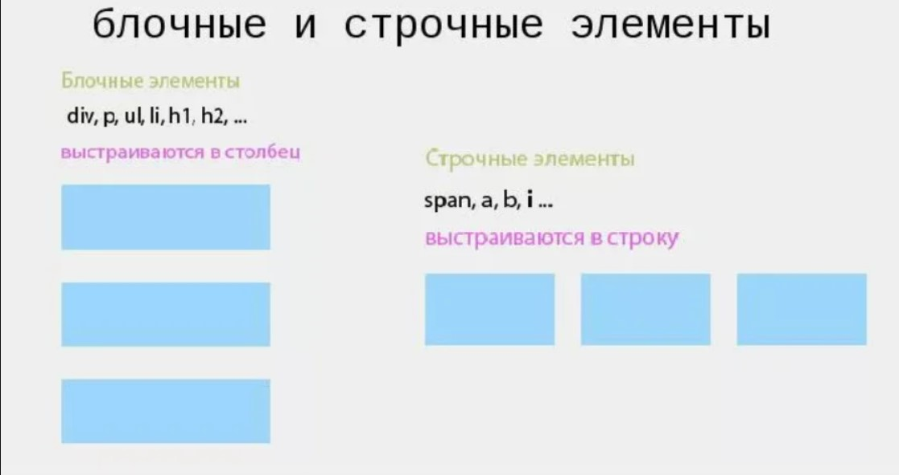
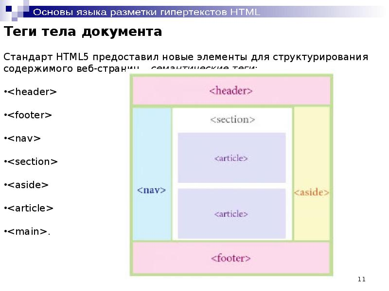

# Виды верстки

1. Табличная
2. Float
3. display-flex  https://angrytools.com/css-flex/
4. grid


Строительные блоки - в верстки (block, inline)





Ссылки

```html
<a href="ссылка">Посмотрите на мою фотографию!</a>
```