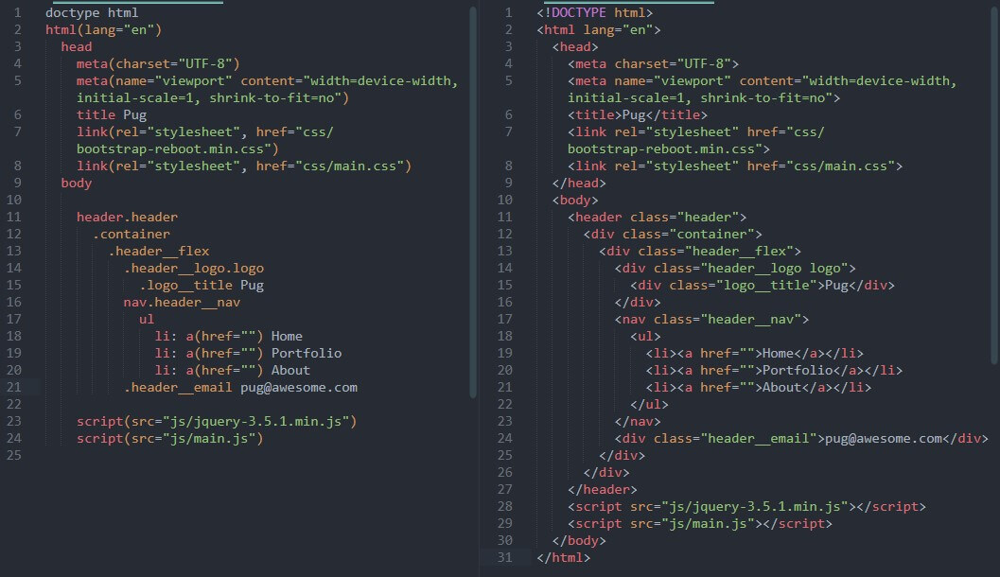

# Шаблонизаторы

::: tip Определение
Шаблонизатор — это инструмент, который позволяет проще писать разметку, делить её на компоненты и связывать с данными.
:::

::: tip Главное преимущество шаблонизаторов
Они избавляют от необходимости писать повторяющийся код несколько раз. Это кажется не такой большой проблемой,
но всё же разработчикам часто приходится тратить на это время.
:::

::: tip Зачем нужны шаблонизаторы
Шаблонизаторы HTML облегчают поддержку кода и ускоряют процесс разработки, особенно если над проектом работает команда. Вот небольшой перечень типовых задач, которые решают с помощью этой технологии:
:::

- создание базовой разметки страниц;
- внесение правок одновременно на нескольких страницах или компонентах;
- изменение контента в блоках;
- добавление, удаление или перенос блоков на страницах сайта;
- создание повторяющегося контента, например карточки товара в каталоге.

<a href="https://htmlacademy.ru/tutorial/php/templates" target="_blank">Статья по шаблонам</a>  
<a href="https://htmlacademy.ru/blog/html/html-templates" target="_blank">Cтатья по шаблонам</a>  

<a href="https://handlebarsjs.com/" target="_blank">Handel Bars</a>  
<a href="https://proglib.io/p/templating-languages-and-engines" target="_blank">11 шаблонизаторов для фронтенда</a>  

## Пример Pug и HTML5

## Сайты по Pug

<a href="https://github.com/pugjs/pug" target="_blank">Pug Github</a>  
<a href="https://pugjs.org/api/getting-started.html" target="_blank">Pug docs</a>  

## Includes

## Tags

## Mixins

## Loops - Циклы

## Интерполяция,  переменные

Интерполяция - В компьютерном программировании интерполяция строк (или интерполяция переменных, подстановка переменных или расширение переменных)

## Наследование - Template Inheritance
https://pugjs.org/language/inheritance.html

## Условия - if else

## Code
https://pugjs.org/language/code.html

## Switch case - условия

## Атрибуты

