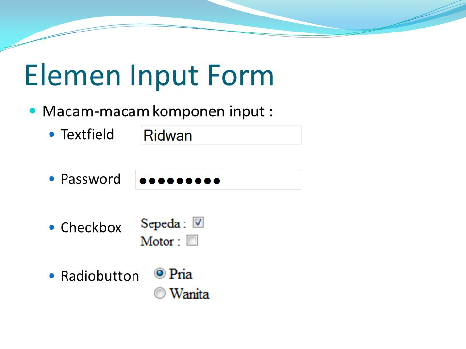

# Формы

```html
<!-- Тело формы обратной связи -->
<form>
    Поле ввода  <input type="text"  name="firstname" value="Введите имя">

    Радио-кнопки <input  type = "radio" name = "sex" value=  "male" checked>
                 <input type = "radio" name = "sex" value="female">

    Чекбоксы  <input type = "checkbox" name = "type1" value = "low">
              <input type = "checkbox" name = "type2" value = "2old">
    
              <button type = "submit">Кнопка отправки формы</button>
</form>
```

