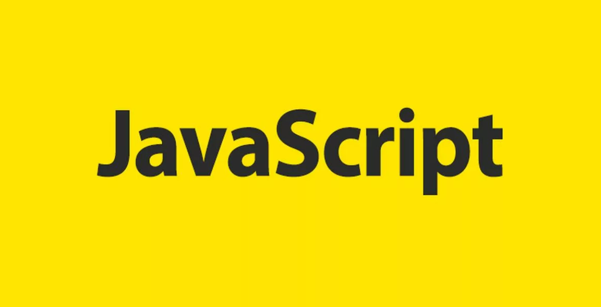

# JavaScript - это

<b>JavaScript</b> — язык программирования широкого спектра. На нём можно как создавать динамические интерфейсы, так и работать с базами данных и операционными системами.
Основная область применения JavaScript — веб. С его помощью можно обмениваться данными между браузером и сервером, изменять HTML и CSS веб-страницы, создавать веб-приложения.

<b>Стандартом языка JavaScript является ECMAScript.</b> По состоянию на 2012 год, все современные браузеры полностью поддерживают ECMAScript 5.1. Старые версии браузеров поддерживают по крайней мере - ECMAScript 3. 17 июня 2015 года состоялся выпуск шестой версии ECMAScript. Эта версия официально называется ECMAScript 2015, которую чаще всего называют ECMAScript 2015 или просто ES2015. С недавнего времени стандарты ECMAScript выпускаются ежегодно.

<b>Не следует путать JavaScript  c языком программирования Java.</b> И "Java", и "JavaScript" являются торговыми марками или зарегистрированными торговыми марками Oracle в США и других странах. Однако, у обоих языков различный синтаксис, семантика и применение.
