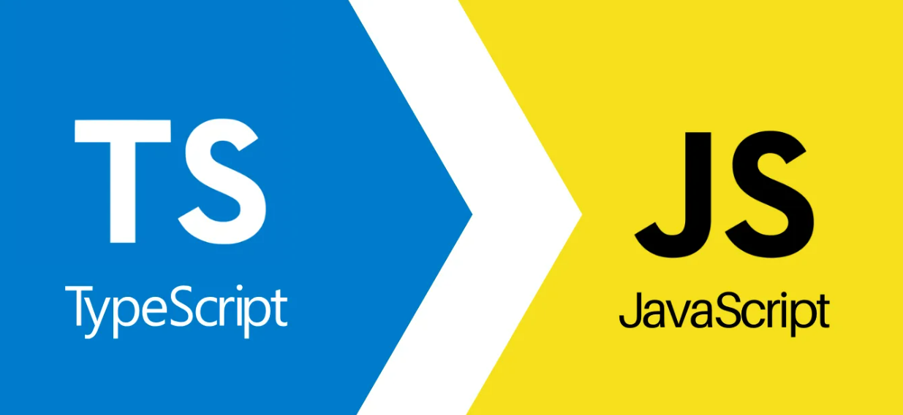
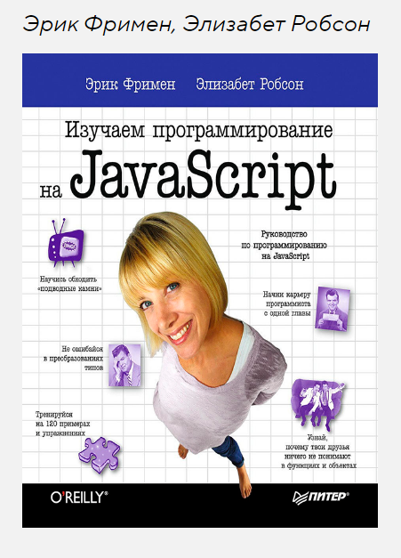
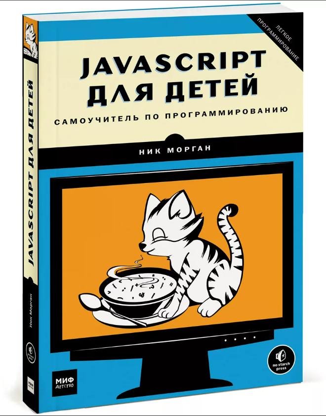

# Разновидности JavaScript - CoffeeScript, TypeScript



```markdown
CoffeeScript — язык программирования, транслируемый в JavaScript. 

CoffeeScript добавляет синтаксический сахар в духе Ruby, Python, Haskell и Erlang для того, 
чтобы улучшить читаемость кода и уменьшить его размер. CoffeeScript позволяет писать 
более компактный код по сравнению с JavaScript. JavaScript-код, получаемый трансляцией из 
CoffeeScript, полностью проходит проверку JavaScript Lint.
```

```markdown
TypeScript — это язык программирования для разработки современных веб-приложений, 
расширяющий возможности уже традиционного JavaScript. В своей статье редакция 
highload.today разобралась, что такое TypeScript, какими он обладает
преимуществами и особенностями.
```

<a target="_blank" href="https://bytescout.com/blog/2016/07/javascript-vs-coffeescript-vs-typescript.html">Статья про сравнения</a>

<a href="https://www.typescriptlang.org/" target="_blank">TS сайт</a>

## Книги





<a href="https://htmlacademy.ru/blog/js/js-books-for-beginners" target="_blank">Cтатья по полезной литературе</a> <br/>

## Учебники

<a href="https://learn.javascript.ru/" target="_blank">Lern js</a> <br/>
<a href="https://www.code.mu/ru/" target="_blank">Code me</a> <br/>
<a href="https://itchief.ru/javascript/" target="_blank">IT chief</a> <br/>
<a href="https://www.wm-school.ru/js/" target="_blank">WM School</a> <br/>
<a href="https://www.schoolsw3.com/js/index.php" target="_blank">Schoolsw3</a>