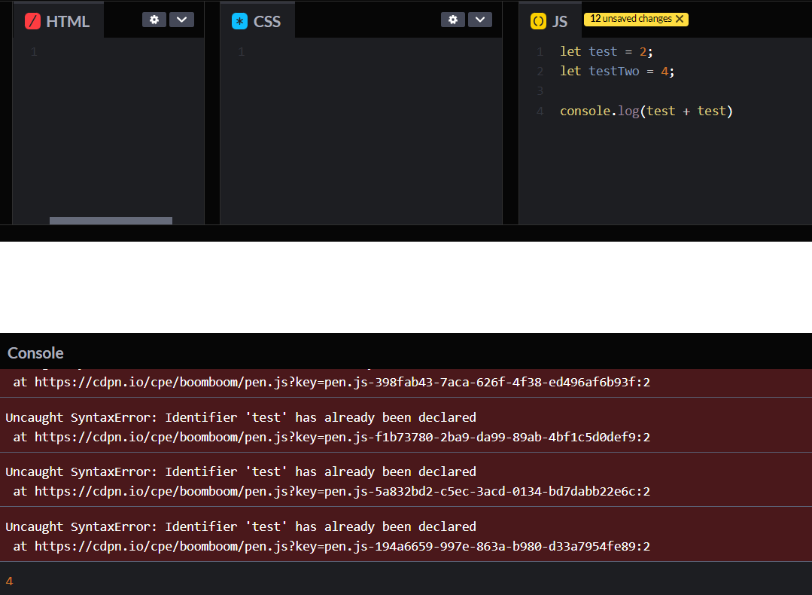
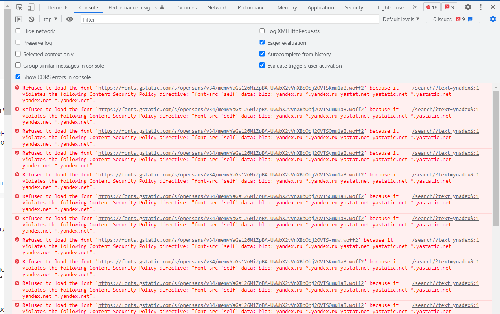

# Online IDE + консоль разработчика 

<a href="https://codepen.io/" target="_blank">Code pen - online IDE</a>

## Консоль

Код уязвим для ошибок. И вы, скорее всего, будете делать ошибки в коде… Впрочем, давайте 
будем откровенны: вы точно будете совершать ошибки в коде. В конце концов, 
вы человек, а не робот.

Но по умолчанию в браузере ошибки не видны. То есть, если что-то пойдёт не 
так, мы не увидим, что именно сломалось, и не сможем это починить.

Для решения задач такого рода в браузер встроены так называемые «Инструменты разработки» 
(Developer tools или сокращённо — devtools).

Chrome и Firefox снискали любовь подавляющего большинства программистов во многом 
благодаря своим отменным инструментам разработчика. Остальные браузеры, хотя и 
оснащены подобными инструментами, но всё же зачастую находятся в роли догоняющих и 
по качеству, и по количеству свойств и особенностей. В общем, почти у всех программистов
есть свой «любимый» браузер. Другие используются только для отлова и исправления специфичных 
«браузерозависимых» ошибок.

Для начала знакомства с этими мощными инструментами давайте выясним, как их открывать, 
смотреть ошибки и запускать команды JavaScript.

