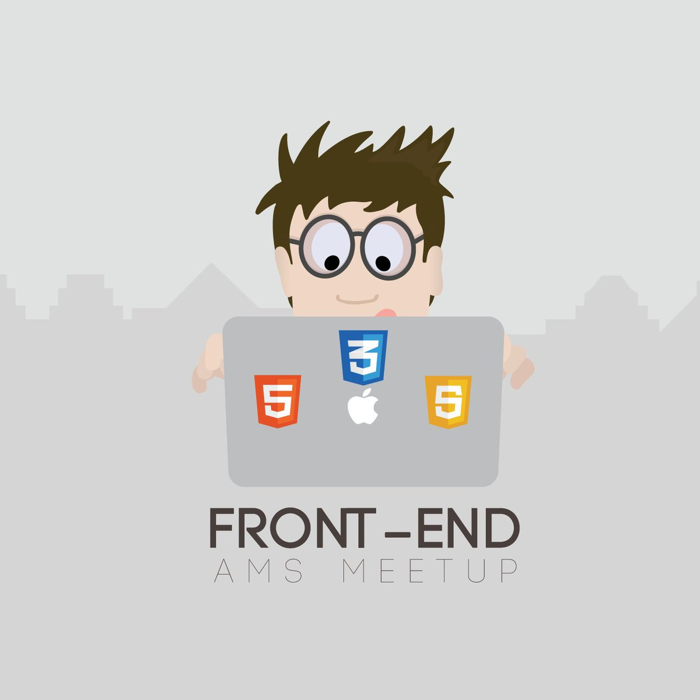

# Знакомство с курсом!

<ul>
    <li>Курс состоит из 5 занятий, по 60 минут каждое ⏲️</li>
    <li>Познакомимся с frontend разработкой в целом, и как она взаимодействует с backend разработкой 💻</li>
    <li>Изучим HTML5, CSS3, JavaScript ES6+ стандарты 📚</li>
    <li>Будем изучать не только теорию, но и писать код 📑</li>
    <li>Сможете полученные знания применить в любой сфере, для автоматизации ваших рабочих процессов 💣</li>
</ul>