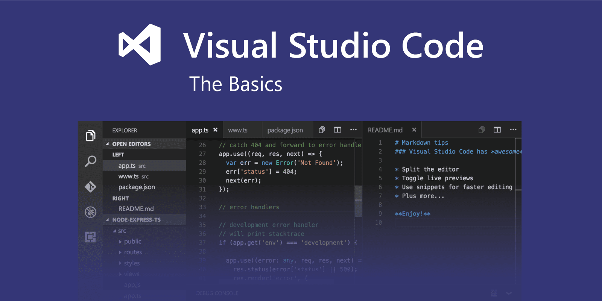

# Инструменты для разработки

## Браузер
<ul>
    <li>Chrome</li>
    <li>FireFox</li>
    <li>Safari</li>
    <li>Yandex</li>
    <li>Другие</li>
</ul>

## IDE - среда разработки

- VSC [Перейти](https://code.visualstudio.com/)

- Sublime Text [Перейти](https://www.sublimetext.com/)

- WebStorm [Перейти](https://www.jetbrains.com/ru-ru/webstorm/)

- Nodepad++ [Перейти](https://notepad-plus-plus.org/)

- Codepen - онлайн сервис для кодинга [Перейти](https://codepen.io)
- Сodesandbox - онлайн сервис для кодинга [Перейти](https://codesandbox.io/)

## Желание и практика

