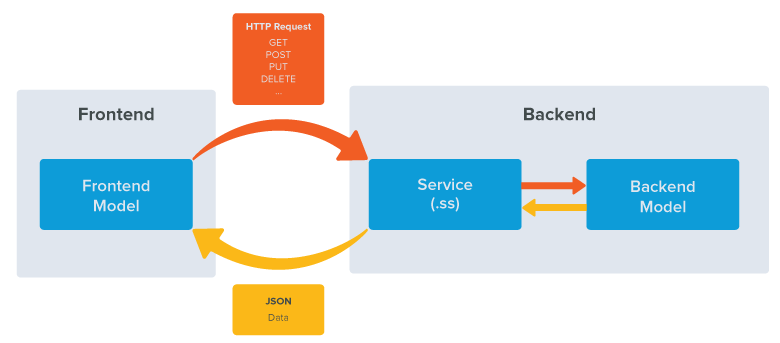
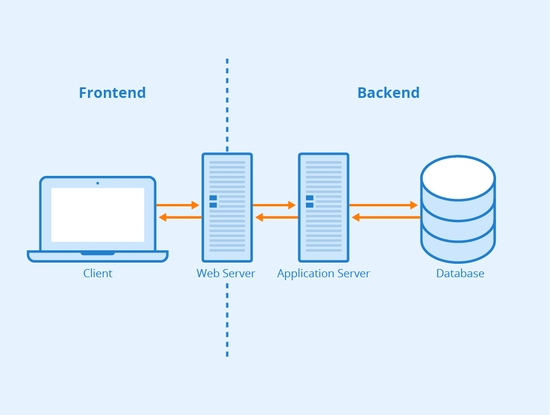
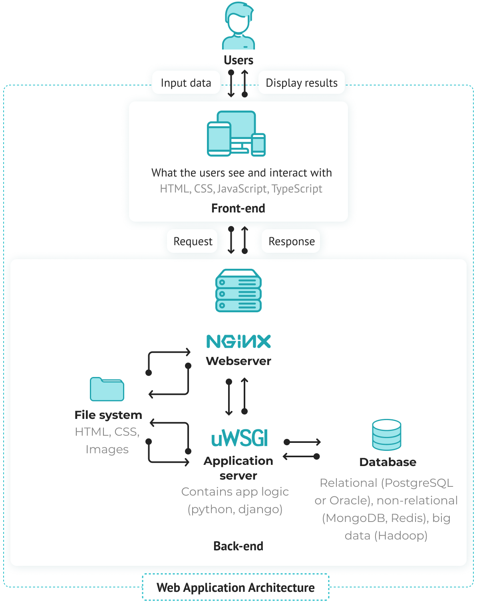

# Взаимодействие frontend с backend

<b>Взаимодействие фронтенда и бэкенда происходит по кругу:</b>

1. Клиентская часть приложения (фронтенд) отправляет пользовательскую информацию на сервер (бэкенд);  
2. Программа на сервере обрабатывает информацию;  
3. Информация возвращается клиентской стороне в понятной для пользователя форме.  

::: warning Пример №1
Картинка
:::

::: warning Пример №2
Картинка
:::

::: warning Пример №3
Картинка
:::

### Пример получения данных с backend-a
 
<getData/>